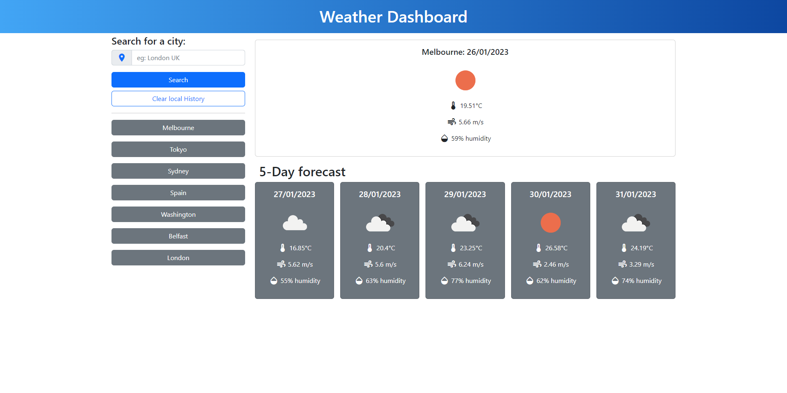

# Weather-Dashboard

This application is to show my ability to make a weather forecast app using an API, when the user inputs a location the location is saved in local storage and the history 
button with that name, the weather today and the 5-day forecast will be rendered on the page if the location is already in local storage another button will not be rendered.
If the history buttons are clicked the weather will also be displayed. 
If the clear history button is pressed the history will be removed and the page will re-render.

## link to the deployed application 

https://marcahudson26.github.io/probable-potato-Weather-Dashboard/

## screenshot of the working application

